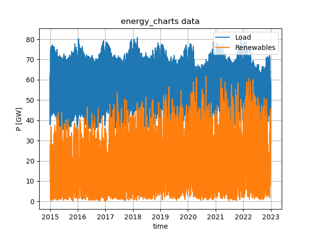
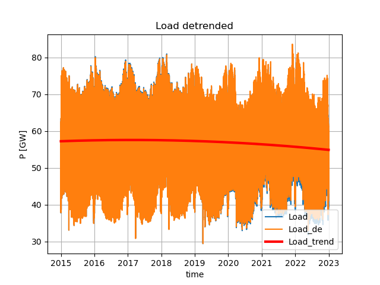
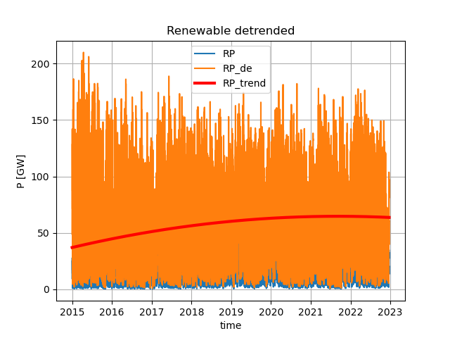
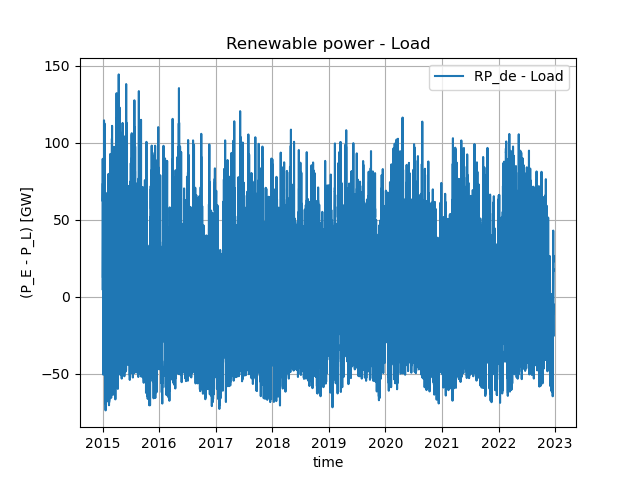
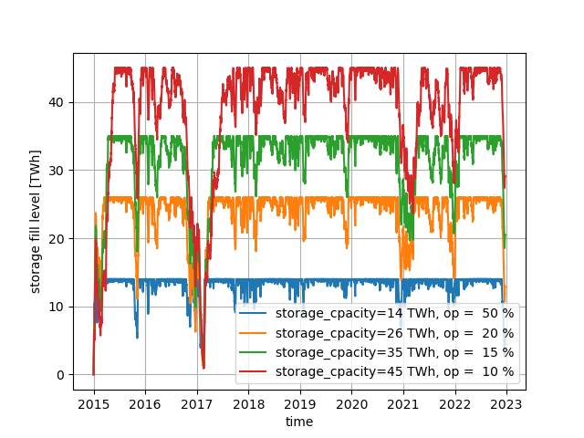

# SISREMO
Simple Storage Reqirement Model for a 100% Renewable Energy System

## Data

1. download power data as json from https://api.energy-charts.info/power using the REST API:
    * the minimum star_year is 2015
    * execute: load_ise_energy_chart_data(start_year, end_year)
        * storage/data_energy_charts.jl
2. Parse downloaded json fiels and store date in a hdf5 file

Data used in this model are:
    1. Dates: UNIX timestamps are converted to Date objects
    2. Load
    3. Sum of Wind offshore, Wind onshore and Solar

## Detrend and Scale Date

The real data are adapted to mimic a 100% renewable eneryg system by deterending and scaling.

### Detrend Load

$k$  - polynomial order
$n$  - number of data points

1. Load trend, polynomial fit
$L_{t} = \operatorname{polynomial\_fit}(L, k)$
2. Detrend
$L_{d} = \dfrac{L_{t}[n/2]}{L_{t}} \; L$

$L$  - Load [MW]
$L_{t}$ -  trend of Load, poynomial fit
$L_{d}$ - detrended Load

### Detrend Renewables

1. First scaling
$R_{s} = R \; \dfrac{\operatorname{mean}(L)}{\operatorname{mean}(R)}$

2. Renewables trend, polynomial fit
$R_t = \operatorname{polynomial\_fit}(R_s, k)$

3. Detrend
$R_d = \dfrac{R_t[n/2]}{R_t} R_s$

4. Scale again
$R_{ds} = R_d \dfrac{\operatorname{mean}(L_d)}{\operatorname{mean}(R_d)}$

5. Diffeernce between Renewables and Laod
$\Delta P = (R_{ds} - L_d)$

$R$ - renewable energy [MW]
$R_{s}$ -scaled $R$
$R_d$ - detrended $R$
$R_t$ - detrended and scaled $R$

## Compute Storage Fill Level as Function of Time

Given storage capacity and an overproduction capacity factor the algorithm is:

    ms = Dates.value(dates[2] - dates[1])
    Δh = ms/(3.6e6)
    storage_capacity = storage_capacity / Δh

    RP = RP .* over_production
    # surplus or shortfall power
    ΔP = (RP - Load)

    n  = size(RP, 1)
    inflow   = zeros(Float64, n)
    outflow  = zeros(Float64, n)
    Import = zeros(Float64, n)
    Export = zeros(Float64, n)
    storage_fill = ones(Float64, n)

    storage_fill[1] = max(0.0, ΔP[1])
    for i in 2:n
        # if surplus
        if ΔP[i] > 0.0
            # add surplus energy to storage (time intervall is multiplied at the end)
            storage_fill[i] = storage_fill[i-1] + ΔP[i]
            inflow[i] = ΔP[i]
            # if storage_capacity is reached
            if storage_fill[i] > storage_capacity
                D = storage_fill[i] - storage_capacity
                storage_fill[i] = storage_capacity
                inflow[i] = ΔP[i] - D
                Export[i] = D
            end
        else # if shortfall
            # substract shortfall energy from storage (time intervall is multiplied at the end)
            storage_fill[i] = storage_fill[i-1] + ΔP[i]
            outflow[i] = ΔP[i]
            # if stotage is empty
            if storage_fill[i] < 0.0
                D = storage_fill[i]
                storage_fill[i] = 0.0
                outflow[i] = ΔP[i] - D
                Import[i] = D
            end
        end
    end
    storage_fill = storage_fill .* Δh
    (storage_fill, inflow ./ M2, outflow ./ M2, Import ./ M2, Export ./ M2)

